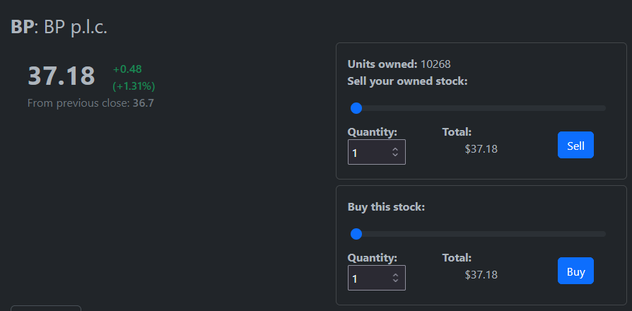
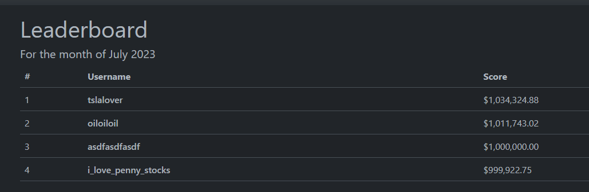
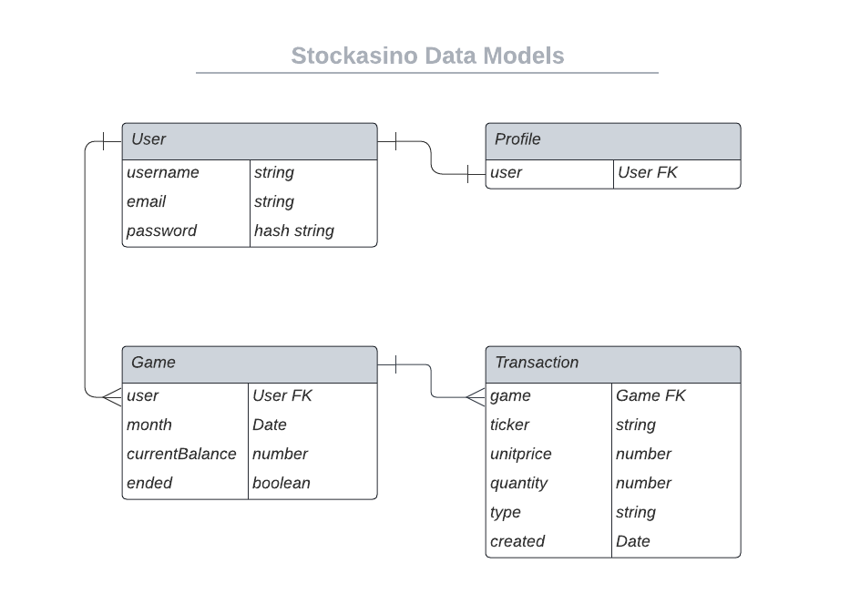
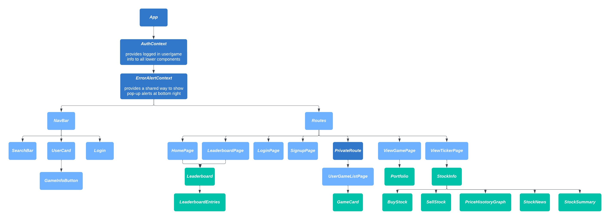

# Stockasino

### General Assembly Software Engineering Immersive Capstone Project

Banks, hedge funds, traders around the world are all collectively gambling entire economies on numbers going up and down.
Why should only they get to have the fun?
Join today and have your own (fake) million dollars to throw around on stocks.

Stockasino is a project to showcase my ability to code full-stack projects from scratch.

## Technologies

- Front-end: **React.js** single-page website, coded in **Typescript** using **Bootstrap** framework.
- Back-end: **Python** backend using the **Django** framework to serve as a RESTful API for the **PostgreSQL** database

## Features

### Comprehensive stock information

https://github.com/t-s-w/stockasino/assets/55447360/b8b3e3f7-1b0d-4565-a74f-eb7e19297cac

News related to tickers, price history graphs, and summary statistics retrieved from Yahoo! Finance API.

### Buy and sell stocks in real time

Fetch the current price from stocks from Yahoo! FInance and buy and sell stocks using fake currency.

### Watch your portfolio go up

https://github.com/t-s-w/stockasino/assets/55447360/f40e2c7c-83cc-4144-9674-6a2ce82a0e77

A portfolio page shows comprehensive information regarding transaction histories.

### See how others are doing

Leaderboards with the top players from each month let you learn from others' investment strategies.

## Data Model

- User: Django comes with a built-in authentication system with its own User model.
- Game: If users were allowed to play indefinitely, over time someone's score would get high enough that no one else can catch up. Stockasino addresses this problem by restricting progress to calendar months. A round for a user in a calendar month is called a Game.
  - The Game model in Django was customised to have three additional methods:
    - `update_balance` makes a Game retrieve all its related transactions and recalculate the current cash balance available to the player.
    - `get_holdings_of_one_stock` makes a Game retrieve all its transactions with regard to one ticker and groups them, then calculates the units of stock held by the player (after buys and sells) then calculates their total cost on a first-in-first-out basis.
    - `summarize_holdings` does the above for all stocks and returns a portfolio of the Game's current holdings along with the other Game details.
- Transaction: Buys and Sells are all stored in the database as transactions which keep track of the price of the stock captured at the time of transaction, along with the quantity bought/sold.

## React Component Hierarchy

